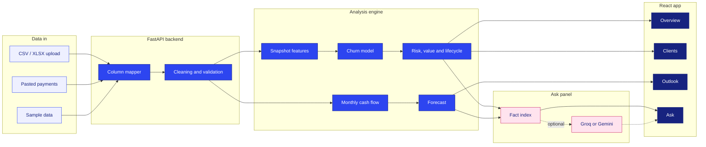

<div align="center">

# AI Risk Manager

**Know which clients will go quiet before your invoices do.**

Upload your payments and see who is drifting away, how much revenue rides on them, and what the next quarter looks like.


</div>

<br>

<p align="center">
  
</p>

## Overview

AI Risk Manager is a client-retention and cash-flow tool for freelancers, agencies and small businesses. It reads a plain list of payments, learns how each client normally pays, and flags the ones whose rhythm is breaking. Every flag comes with the money at stake and a suggested next step.

| Capability | What you get |
|---|---|
| Churn prediction | The probability that each client pays nothing in the next 90 days |
| Payment rhythm | A month-by-month view of each client, with the silence since their last payment highlighted |
| Revenue at stake | Expected 12-month revenue per client, discounted by their churn probability |
| Forecast | A 3-month revenue and cash-flow forecast with a likely range and a backtest error |
| Ask | Questions about your own numbers, answered from retrieved facts with citations |
| Flexible input | CSV or Excel upload, pasted payments, or built-in sample data |

## Architecture



### How the churn model learns

```mermaid
flowchart LR
    S1["Pick cutoff dates<br/>every 14 days"] --> S2["Build features using<br/>only data before the cutoff"]
    S2 --> S3["Label: did the client pay<br/>in the next 90 days?"]
    S3 --> S4["Train on earlier cutoffs"]
    S4 --> S5["Test on later cutoffs<br/>with a purge gap"]
    S5 --> S6["Compare against a simple<br/>overdue rule"]
    S6 --> S7["Refit on all history<br/>and score every client today"]

    classDef step fill:#eef0ff,stroke:#2d45f0,color:#17237f
    class S1,S2,S3,S4,S5,S6,S7 step
```



The same feature function is used for training and for scoring, so the model never sees information from after a cutoff. On the bundled sample data the model reaches an AUC of **0.76**, against **0.55** for the simple overdue rule, on a period it never saw during training.

## Tech stack

<p align="center">
  
</p>

| Layer | Tools |
|---|---|
| Backend | Python, FastAPI, Uvicorn |
| Data and ML | pandas, NumPy, scikit-learn (random forest), rapidfuzz for column matching |
| Retrieval | TF-IDF from scikit-learn, with an optional free LLM through Groq or Gemini |
| Frontend | React, custom SVG charts, esbuild |

## Getting started

**Requirements:** Python 3.10 or newer. Node.js is only needed if you want to edit the interface.

```bash
git clone https://github.com/YOUR-USERNAME/ai-risk-manager.git
cd ai-risk-manager

python -m venv .venv
source .venv/bin/activate          # Windows: .venv\Scripts\activate

pip install -r requirements.txt
uvicorn main:app --reload
```

Open **http://127.0.0.1:8000** and click **Try sample data**.

The React app is pre-built in `frontend/dist/app.js`. To change the interface:

```bash
cd frontend
npm install
npm run build
```

## Ask panel with a free LLM

The Ask panel works without any key and returns the matching facts directly. Add a free key and it writes a short answer with citations instead.

| Provider | Get a key | Environment variable | Default model |
|---|---|---|---|
| Groq | console.groq.com/keys | `GROQ_API_KEY` | `llama-3.3-70b-versatile` |
| Gemini | aistudio.google.com/apikey | `GEMINI_API_KEY` | `gemini-2.5-flash` |
| Any OpenAI-compatible service | the provider's site | `LLM_API_KEY`, `LLM_BASE_URL`, `LLM_MODEL` | set by you |

```bash
export GROQ_API_KEY=your_key       # PowerShell: $env:GROQ_API_KEY="your_key"
uvicorn main:app --reload
```

Set `LLM_MODEL` to override the default model. Only your question and the retrieved facts are sent to the provider, never the uploaded files. Gemini's free tier may use prompts to improve Google products, so prefer Groq for sensitive client data. If the provider is unavailable, Ask falls back to showing the matching facts.

## Try it on real data

Two public datasets work with the included converters.

| Dataset | Source | Convert with |
|---|---|---|
| Online Retail II, real wholesale customers from 2009 to 2011 | [UCI Machine Learning Repository](https://archive.ics.uci.edu/dataset/502/online+retail+ii) | `python tools/prepare_retail.py online_retail_II.csv` |
| Payment Date Dataset, real invoices with due and paid dates | Kaggle, search for "Payment Date Dataset" | `python tools/prepare_payments.py dataset.csv` |

Each script writes upload-ready files to `data_ready/`. Upload both generated files together for the invoice dataset.

To use your own data, export payments from your accounting tool as CSV. Any file with a client, a date and an amount column works. Add a `type` column (income or expense) to track costs, and an invoices file with `client_id`, `due_date` and `paid_date` to include payment delays.

## Project structure

```
ai-risk-manager/
├── main.py                  # app entry point
├── train_model.py           # backtest the churn model on any dataset
├── data_generation.py       # builds the sample data
├── requirements.txt
├── core/
│   ├── api.py               # FastAPI routes
│   ├── analysis.py          # orchestration and JSON payloads
│   ├── data_pipelining.py   # cleaning and monthly summaries
│   ├── churn.py             # snapshot features and churn model
│   ├── models.py            # lifecycle, hybrid risk, client value
│   ├── business_risk.py     # overall business risk score
│   ├── forecast.py          # trend and seasonality forecast
│   ├── rag.py               # retrieval and optional LLM answers
│   ├── mapper.py            # fuzzy column matching
│   ├── ingestion.py         # CSV and Excel loading
│   ├── validator.py
│   └── auth.py
├── frontend/
│   ├── index.html
│   ├── styles.css
│   ├── src/                 # React source
│   └── dist/app.js          # pre-built bundle
├── data/                    # sample transactions, clients, invoices
└── tools/                   # converters for public datasets
```

## API reference

| Method | Endpoint | Purpose |
|---|---|---|
| POST | `/upload` | Upload CSV or XLSX files |
| POST | `/manual-entry` | Submit pasted payments |
| POST | `/demo` | Load the sample data |
| GET | `/dashboard` | Overview payload |
| GET | `/clients` | Per-client scores |
| GET | `/forecast` | Revenue forecast and churn outlook |
| GET | `/download-clients` | Client analysis as CSV |
| POST | `/ask` | Ask a question about the loaded data |
| POST | `/auth/signup`, `/auth/login` | Account creation and sign-in |

## Limits

- A client counts as churned after 90 days without a payment. Change `HORIZON` in `core/churn.py` for businesses with longer payment cycles.
- The model needs roughly 8 months of history and some lapsed clients to learn. With less, it uses simple rules and says so on the Overview.
- The forecast is a trend and seasonality model, so it does not anticipate one-off events.
